# Laporan UAS Mata Kuliah Kecerdasan Buatan

## Prediksi Tingkat Produktivitas Petani Menggunakan Algoritma Decision Tree dan K-Nearest Neighbor (KNN)

---

# Identitas

**Kelompok 16**
**Nama** : Muhammad Saepul Hidayat_2406025
**Nama** : Maulana Muhammad Zaki_2406028

**Mata Kuliah** : Kecerdasan Buatan

**Program Studi** : Teknik Informatika

**Universitas** : Institut Teknologi Garut

**Tahun** : 2026

---

# BAB I

# PENDAHULUAN

## 1.1 Latar Belakang

Perkembangan teknologi kecerdasan buatan (Artificial Intelligence/AI) dan machine learning telah memberikan kontribusi yang signifikan dalam berbagai sektor, salah satunya adalah sektor pertanian. Melalui pemanfaatan data yang tersedia, machine learning mampu membantu proses analisis dan pengambilan keputusan secara lebih cepat, akurat, dan objektif.

Produktivitas pertanian dipengaruhi oleh berbagai faktor, seperti ukuran lahan, pengalaman petani, penggunaan pupuk, penggunaan pestisida, metode irigasi, tingkat pendidikan, serta akses pasar. Analisis terhadap faktor-faktor tersebut secara manual membutuhkan waktu yang cukup lama dan berpotensi menghasilkan keputusan yang kurang optimal.

Dengan memanfaatkan algoritma machine learning, hubungan antara faktor-faktor tersebut dapat dipelajari sehingga memungkinkan dilakukan klasifikasi tingkat produktivitas petani berdasarkan karakteristik yang dimiliki.

Pada penelitian ini digunakan dataset **Farmers Dataset** yang berisi informasi mengenai karakteristik petani dan kondisi pertanian. Dataset tersebut dianalisis menggunakan dua algoritma klasifikasi, yaitu **Decision Tree** dan **K-Nearest Neighbor (KNN)**. Selanjutnya kedua algoritma dibandingkan menggunakan beberapa metrik evaluasi untuk mengetahui model yang memberikan performa terbaik.

Hasil penelitian diharapkan dapat memberikan gambaran mengenai penerapan machine learning dalam klasifikasi produktivitas petani serta menjadi referensi dalam pengembangan sistem pendukung keputusan di bidang pertanian.

---

## 1.2 Rumusan Masalah

Berdasarkan latar belakang tersebut, maka rumusan masalah dalam penelitian ini adalah:

1. Bagaimana karakteristik data pada Farmers Dataset?
2. Bagaimana melakukan proses preprocessing sebelum membangun model machine learning?
3. Bagaimana membangun model klasifikasi menggunakan algoritma Decision Tree?
4. Bagaimana membangun model klasifikasi menggunakan algoritma K-Nearest Neighbor (KNN)?
5. Algoritma manakah yang memiliki performa terbaik berdasarkan hasil evaluasi?

---

## 1.3 Tujuan Penelitian

Penelitian ini bertujuan untuk:

1. Menganalisis karakteristik data petani yang terdapat pada Farmers Dataset.
2. Melakukan proses Data Preparation agar dataset siap digunakan dalam proses pemodelan.
3. Membangun model klasifikasi menggunakan algoritma Decision Tree.
4. Membangun model klasifikasi menggunakan algoritma K-Nearest Neighbor (KNN).
5. Membandingkan performa kedua algoritma berdasarkan nilai Accuracy, Precision, Recall, dan F1-Score.

---

## 1.4 Manfaat Penelitian

Adapun manfaat dari penelitian ini adalah sebagai berikut:

### 1. Bagi Penulis

Menambah pengetahuan mengenai penerapan machine learning dalam menyelesaikan permasalahan klasifikasi pada bidang pertanian.

### 2. Bagi Akademik

Menjadi referensi pembelajaran mengenai implementasi algoritma Decision Tree dan K-Nearest Neighbor dalam klasifikasi data.

### 3. Bagi Pengguna

Memberikan gambaran mengenai pemanfaatan machine learning dalam membantu analisis tingkat produktivitas petani berdasarkan karakteristik yang dimiliki.

---

## 1.5 Batasan Masalah

Batasan masalah pada penelitian ini adalah:

1. Dataset yang digunakan adalah **Farmers Dataset**.
2. Penelitian hanya menggunakan algoritma Decision Tree dan K-Nearest Neighbor (KNN).
3. Target klasifikasi adalah **Productivity** yang terdiri dari tiga kelas, yaitu Low, Medium, dan High.
4. Evaluasi model menggunakan metrik Accuracy, Precision, Recall, F1-Score, dan Confusion Matrix.
5. Implementasi dilakukan menggunakan bahasa pemrograman Python dengan library Scikit-learn.

# BAB II

# TINJAUAN PUSTAKA

## 2.1 Kecerdasan Buatan (Artificial Intelligence)

Kecerdasan Buatan (Artificial Intelligence/AI) merupakan cabang ilmu komputer yang bertujuan untuk mengembangkan sistem yang mampu meniru kemampuan berpikir manusia, seperti belajar dari data, melakukan penalaran, mengambil keputusan, serta menyelesaikan suatu permasalahan secara otomatis. AI telah banyak diterapkan pada berbagai bidang, seperti kesehatan, pendidikan, industri, keuangan, hingga pertanian.

Dalam bidang pertanian, Artificial Intelligence dapat dimanfaatkan untuk membantu proses analisis data sehingga mampu menghasilkan informasi yang dapat digunakan dalam pengambilan keputusan. Salah satu implementasi AI adalah penggunaan teknik Machine Learning untuk melakukan klasifikasi maupun prediksi berdasarkan data historis yang tersedia.

---

## 2.2 Machine Learning

Machine Learning merupakan bagian dari Artificial Intelligence yang memungkinkan komputer mempelajari pola dari sekumpulan data tanpa harus diprogram secara eksplisit untuk setiap kondisi. Model machine learning dibangun menggunakan data pelatihan (training data) sehingga mampu mengenali pola dan menghasilkan prediksi terhadap data baru.

Secara umum Machine Learning dibagi menjadi tiga kategori utama, yaitu:

1. Supervised Learning
2. Unsupervised Learning
3. Reinforcement Learning

Pada penelitian ini digunakan metode **Supervised Learning**, karena dataset telah memiliki target (label) yaitu tingkat produktivitas petani (Productivity).

---

## 2.3 Klasifikasi

Klasifikasi merupakan salah satu teknik dalam supervised learning yang bertujuan untuk mengelompokkan suatu data ke dalam kelas tertentu berdasarkan karakteristik yang dimiliki.

Dalam penelitian ini proses klasifikasi dilakukan untuk menentukan kategori produktivitas petani yang terdiri dari tiga kelas, yaitu:

- Low
- Medium
- High

Proses klasifikasi dilakukan menggunakan dua algoritma, yaitu Decision Tree dan K-Nearest Neighbor (KNN).

---

## 2.4 Decision Tree

Decision Tree merupakan algoritma machine learning yang membangun model dalam bentuk struktur pohon keputusan. Setiap simpul (node) pada pohon merepresentasikan suatu atribut, sedangkan cabang menunjukkan hasil pengambilan keputusan berdasarkan nilai atribut tersebut.

Keunggulan Decision Tree antara lain:

- Mudah dipahami dan diinterpretasikan.
- Mampu menangani data numerik maupun kategorikal.
- Tidak memerlukan proses normalisasi data.
- Memiliki proses pelatihan yang relatif cepat.

Namun demikian, Decision Tree memiliki kelemahan yaitu rentan mengalami overfitting apabila kedalaman pohon tidak dikendalikan dengan baik.

Pada penelitian ini Decision Tree digunakan sebagai salah satu algoritma pembanding untuk mengklasifikasikan tingkat produktivitas petani.

---

## 2.5 K-Nearest Neighbor (KNN)

K-Nearest Neighbor (KNN) merupakan algoritma klasifikasi yang menentukan kelas suatu data berdasarkan kedekatan jarak terhadap sejumlah tetangga terdekat (nearest neighbors).

Nilai K menunjukkan jumlah tetangga yang digunakan dalam proses klasifikasi. Semakin besar nilai K, maka proses klasifikasi mempertimbangkan lebih banyak data di sekitarnya.

Karena menggunakan perhitungan jarak, algoritma KNN memerlukan proses standardisasi data agar setiap atribut memiliki skala yang seimbang.

Pada penelitian ini nilai awal K ditentukan sebesar 5, kemudian dilakukan proses hyperparameter tuning menggunakan GridSearchCV untuk memperoleh parameter terbaik.

---

## 2.6 Exploratory Data Analysis (EDA)

Exploratory Data Analysis (EDA) merupakan proses eksplorasi data menggunakan teknik statistik dan visualisasi sebelum dilakukan pemodelan.

Tahapan EDA bertujuan untuk:

- Memahami karakteristik data.
- Mengetahui distribusi data.
- Mengidentifikasi hubungan antar variabel.
- Mendeteksi adanya outlier.
- Membantu menentukan proses preprocessing yang diperlukan.

Pada penelitian ini EDA dilakukan menggunakan beberapa visualisasi, yaitu:

- Histogram
- Pie Chart
- Count Plot
- Box Plot
- Heatmap
- Pairplot

Visualisasi tersebut digunakan untuk memahami pola data sebelum dilakukan proses pemodelan.

---

## 2.7 Data Preparation

Data Preparation merupakan tahap untuk mempersiapkan dataset agar dapat digunakan oleh algoritma machine learning.

Tahapan yang dilakukan dalam penelitian ini meliputi:

- Label Encoding terhadap seluruh atribut kategorikal.
- Pembentukan variabel feature (X) dan target (y).
- Standardisasi menggunakan StandardScaler.
- Pembagian data menjadi data training dan data testing dengan rasio 80:20.

Tahapan ini bertujuan agar data siap digunakan dalam proses pelatihan model.

---

## 2.8 Evaluasi Model

Evaluasi model dilakukan untuk mengetahui performa algoritma klasifikasi yang telah dibangun.

Beberapa metrik evaluasi yang digunakan dalam penelitian ini adalah:

### 1. Accuracy

Accuracy merupakan perbandingan antara jumlah prediksi yang benar terhadap seluruh data pengujian.

Semakin tinggi nilai accuracy menunjukkan bahwa model memiliki kemampuan klasifikasi yang semakin baik.

### 2. Precision

Precision menunjukkan tingkat ketepatan model dalam memberikan prediksi terhadap suatu kelas.

Nilai precision yang tinggi menunjukkan bahwa jumlah prediksi positif yang salah relatif sedikit.

### 3. Recall

Recall menunjukkan kemampuan model dalam menemukan seluruh data yang benar-benar termasuk ke dalam suatu kelas.

Semakin tinggi nilai recall menunjukkan bahwa model mampu mengenali data dengan lebih baik.

### 4. F1-Score

F1-Score merupakan rata-rata harmonik antara Precision dan Recall sehingga memberikan gambaran keseimbangan performa model.

### 5. Confusion Matrix

Confusion Matrix merupakan tabel yang digunakan untuk melihat jumlah prediksi yang benar maupun salah pada setiap kelas.

Melalui Confusion Matrix dapat diketahui pola kesalahan klasifikasi yang dilakukan oleh model.

---

## 2.9 Penelitian Terdahulu

Penelitian mengenai penerapan machine learning dalam bidang pertanian telah banyak dilakukan. Algoritma Decision Tree banyak digunakan karena mudah diinterpretasikan dan mampu menangani data numerik maupun kategorikal. Sementara itu, algoritma K-Nearest Neighbor dikenal memiliki performa yang baik pada data yang telah melalui proses normalisasi.

Beberapa penelitian juga menunjukkan bahwa proses preprocessing, seperti encoding dan standardisasi data, berpengaruh terhadap peningkatan performa model klasifikasi. Oleh karena itu, pada penelitian ini dilakukan Data Preparation sebelum membangun model Decision Tree dan KNN.

---

## 2.10 Kerangka Pemikiran

Penelitian ini dilakukan melalui tahapan sebagai berikut:

1. Pengumpulan dataset petani.
2. Business Understanding.
3. Data Understanding.
4. Exploratory Data Analysis (EDA).
5. Data Preparation.
6. Pembangunan model Decision Tree.
7. Pembangunan model K-Nearest Neighbor.
8. Hyperparameter Tuning menggunakan GridSearchCV.
9. Evaluasi model menggunakan Accuracy, Precision, Recall, F1-Score, dan Confusion Matrix.
10. Penarikan kesimpulan berdasarkan hasil evaluasi model.

# BAB III

# METODOLOGI PENELITIAN

## 3.1 Metode Penelitian

Penelitian ini menggunakan pendekatan **Machine Learning** dengan metode **Supervised Learning** untuk melakukan klasifikasi tingkat produktivitas petani berdasarkan karakteristik yang terdapat pada dataset. Dataset yang digunakan adalah **Farmers Dataset**, yang berisi informasi mengenai kondisi petani, lahan pertanian, penggunaan pupuk, penggunaan pestisida, metode irigasi, pengalaman bertani, serta hasil panen.

Dalam penelitian ini digunakan dua algoritma klasifikasi, yaitu **Decision Tree** dan **K-Nearest Neighbor (KNN)**. Kedua algoritma dipilih karena memiliki karakteristik yang berbeda dalam proses klasifikasi sehingga dapat dibandingkan performanya.

Seluruh proses penelitian dilakukan menggunakan bahasa pemrograman Python dengan bantuan beberapa library, seperti Pandas, NumPy, Matplotlib, Seaborn, dan Scikit-learn.

---

## 3.2 Dataset Penelitian

Dataset yang digunakan dalam penelitian ini adalah **Farmers Dataset** yang berisi data karakteristik petani dan hasil panen.

Atribut yang terdapat pada dataset dijelaskan pada Tabel 3.1.

### Tabel 3.1 Atribut Dataset Farmers

| No  | Nama Atribut                  | Keterangan                |
| --- | ----------------------------- | ------------------------- |
| 1   | Farmer_ID                     | Identitas petani          |
| 2   | Country                       | Negara asal petani        |
| 3   | Age                           | Usia petani               |
| 4   | Gender                        | Jenis kelamin petani      |
| 5   | Farm_Size                     | Ukuran lahan pertanian    |
| 6   | Crop_Type                     | Jenis tanaman             |
| 7   | Annual_Income_USD             | Pendapatan tahunan petani |
| 8   | Irrigation_Method             | Metode irigasi            |
| 9   | Education_Level               | Tingkat pendidikan        |
| 10  | Years_of_Experience           | Lama pengalaman bertani   |
| 11  | Market_Access                 | Akses terhadap pasar      |
| 12  | Fertilizer_Use_kg_per_acre    | Penggunaan pupuk          |
| 13  | Pesticide_Use_liters_per_acre | Penggunaan pestisida      |
| 14  | Yield_per_Acre_kg             | Hasil panen               |
| 15  | Productivity                  | Target klasifikasi        |

Pada penelitian ini atribut **Productivity** digunakan sebagai variabel target (label), sedangkan atribut lainnya digunakan sebagai variabel prediktor (feature). Variabel target dibagi menjadi tiga kategori, yaitu **Low**, **Medium**, dan **High** berdasarkan proses pembentukan kelas menggunakan metode **Quantile (qcut)** terhadap nilai **Yield_per_Acre_kg**.

---

## 3.3 Tahapan Penelitian

Penelitian dilakukan melalui beberapa tahapan yang saling berkaitan mulai dari memahami permasalahan, melakukan analisis data, membangun model machine learning, hingga mengevaluasi performa model.

### 3.3.1 Business Understanding

Tahap Business Understanding merupakan tahap awal untuk memahami tujuan penelitian serta permasalahan yang akan diselesaikan. Fokus penelitian ini adalah membangun model klasifikasi yang mampu memprediksi tingkat produktivitas petani berdasarkan karakteristik yang dimiliki.

Pada tahap ini juga ditentukan algoritma yang digunakan, yaitu Decision Tree dan K-Nearest Neighbor (KNN), sebagai model yang akan dibandingkan performanya.

---

### 3.3.2 Data Understanding

Tahap Data Understanding bertujuan untuk memahami karakteristik dataset sebelum dilakukan proses analisis lebih lanjut.

Analisis yang dilakukan meliputi:

- Menampilkan lima data pertama (head).
- Menampilkan informasi dataset (info).
- Mengidentifikasi jumlah data dan jumlah atribut.
- Mengetahui tipe data setiap atribut.
- Mengidentifikasi missing value.
- Mengidentifikasi data duplikat.
- Menampilkan statistik deskriptif data numerik.

Tahap ini dilakukan untuk memastikan bahwa dataset memiliki kualitas yang baik sehingga siap digunakan pada proses analisis berikutnya.

---

### 3.3.3 Exploratory Data Analysis (EDA)

Exploratory Data Analysis (EDA) dilakukan untuk memahami pola dan karakteristik data melalui visualisasi.

Visualisasi yang digunakan dalam penelitian ini meliputi:

- Histogram
- Pie Chart
- Count Plot
- Box Plot
- Heatmap
- Pairplot

Melalui visualisasi tersebut dapat diketahui distribusi data, hubungan antarvariabel, serta mendeteksi adanya data yang memiliki karakteristik berbeda (outlier).

---

### 3.3.4 Data Preparation

Tahap Data Preparation bertujuan untuk mempersiapkan data sebelum digunakan dalam proses pelatihan model.

Proses yang dilakukan meliputi:

- Melakukan Label Encoding pada seluruh atribut kategorikal.
- Menentukan variabel feature (X) dan target (y).
- Melakukan standardisasi data menggunakan StandardScaler.
- Membagi dataset menjadi data latih (training data) sebesar 80% dan data uji (testing data) sebesar 20%.

Tahapan ini dilakukan agar data memiliki format yang sesuai dengan kebutuhan algoritma machine learning.

---

### 3.3.5 Pembangunan Model

Pada tahap ini dilakukan pembangunan model klasifikasi menggunakan dua algoritma machine learning.

#### a. Decision Tree

Model Decision Tree dibangun menggunakan data latih untuk menghasilkan pohon keputusan yang mampu mengklasifikasikan tingkat produktivitas petani berdasarkan atribut-atribut yang tersedia.

#### b. K-Nearest Neighbor (KNN)

Model K-Nearest Neighbor (KNN) melakukan proses klasifikasi berdasarkan kedekatan jarak antar data. Oleh karena itu, sebelum proses pelatihan dilakukan standardisasi data agar seluruh atribut memiliki skala yang sebanding.

---

### 3.3.6 Hyperparameter Tuning

Untuk memperoleh performa model yang lebih baik dilakukan proses pencarian parameter terbaik menggunakan **GridSearchCV**.

Pada algoritma Decision Tree dilakukan pencarian beberapa parameter seperti **criterion** dan **max_depth**, sedangkan pada algoritma KNN dilakukan pencarian parameter **jumlah tetangga (n_neighbors)** serta **weights**.

Parameter terbaik yang diperoleh kemudian digunakan untuk membangun model akhir.

---

### 3.3.7 Evaluasi Model

Tahap evaluasi dilakukan untuk mengetahui tingkat performa model yang telah dibangun.

Evaluasi menggunakan beberapa metrik, yaitu:

- Accuracy
- Precision
- Recall
- F1-Score
- Confusion Matrix

Hasil evaluasi dari kedua algoritma kemudian dibandingkan untuk menentukan model yang memiliki performa terbaik dalam mengklasifikasikan tingkat produktivitas petani.

---

### 3.3.8 Penarikan Kesimpulan

Tahap terakhir merupakan penarikan kesimpulan berdasarkan hasil evaluasi model. Kesimpulan disusun dengan membandingkan performa algoritma Decision Tree dan K-Nearest Neighbor sehingga diperoleh model yang paling sesuai untuk melakukan klasifikasi tingkat produktivitas petani pada dataset yang digunakan.

# BAB IV

# HASIL DAN PEMBAHASAN

## 4.1 Business Understanding

Business Understanding merupakan tahap awal dalam penelitian yang bertujuan untuk memahami permasalahan, menentukan tujuan penelitian, serta menetapkan pendekatan yang akan digunakan dalam proses pembangunan model machine learning. Tahap ini menjadi dasar dalam keseluruhan penelitian karena menentukan arah analisis yang akan dilakukan pada tahapan berikutnya.

Permasalahan yang diangkat dalam penelitian ini adalah bagaimana memanfaatkan teknik machine learning untuk mengklasifikasikan tingkat produktivitas petani berdasarkan karakteristik yang dimiliki. Produktivitas pertanian dipengaruhi oleh berbagai faktor, seperti usia petani, ukuran lahan, jenis tanaman yang dibudidayakan, metode irigasi, tingkat pendidikan, pengalaman bertani, penggunaan pupuk, penggunaan pestisida, serta hasil panen yang diperoleh. Banyaknya faktor tersebut menyebabkan proses analisis secara manual menjadi kurang efektif sehingga diperlukan suatu model klasifikasi yang mampu mengenali pola hubungan antaratribut.

Dataset yang digunakan pada penelitian ini adalah **Farmers Dataset**, yang terdiri atas **1.000 data** dengan **14 atribut fitur** dan **1 atribut target** yaitu **Productivity**. Variabel target digunakan sebagai kelas yang akan diprediksi oleh model machine learning. Berdasarkan proses pembentukan kelas pada notebook, variabel Productivity dibagi menjadi tiga kategori, yaitu **Low**, **Medium**, dan **High**, sehingga penelitian ini termasuk ke dalam permasalahan klasifikasi multikelas (multiclass classification). :contentReference[oaicite:0]{index=0}

Untuk menyelesaikan permasalahan tersebut digunakan dua algoritma klasifikasi, yaitu **Decision Tree** dan **K-Nearest Neighbor (KNN)**. Decision Tree dipilih karena mampu membentuk aturan keputusan yang mudah dipahami melalui struktur pohon, sedangkan K-Nearest Neighbor dipilih karena melakukan klasifikasi berdasarkan kedekatan jarak antar data. Kedua algoritma dipilih agar dapat dibandingkan performanya pada dataset yang sama sehingga dapat diketahui model yang memberikan hasil klasifikasi terbaik.

Tahapan penelitian dilaksanakan secara bertahap dimulai dari Data Understanding, Exploratory Data Analysis (EDA), Data Preparation, pembangunan model, Hyperparameter Tuning, hingga Evaluation. Seluruh tahapan tersebut diimplementasikan menggunakan bahasa pemrograman Python dengan memanfaatkan beberapa pustaka seperti Pandas, NumPy, Matplotlib, Seaborn, dan Scikit-learn.

Hasil dari tahap Business Understanding menunjukkan bahwa pendekatan machine learning dapat diterapkan untuk membangun model klasifikasi produktivitas petani. Selanjutnya dilakukan proses pemahaman terhadap dataset agar karakteristik data dapat diketahui sebelum memasuki tahap eksplorasi dan pemodelan.

## 4.2 Data Understanding

Tahap **Data Understanding** bertujuan untuk memahami karakteristik dataset yang digunakan sebelum dilakukan proses eksplorasi data maupun pembangunan model machine learning. Pada tahap ini dilakukan pemeriksaan terhadap struktur dataset, tipe data setiap atribut, statistik deskriptif, keberadaan _missing value_, data duplikat, serta distribusi variabel target. Hasil dari tahapan ini menjadi dasar dalam menentukan proses _preprocessing_ yang akan dilakukan pada tahap berikutnya.

---

### 4.2.1 Menampilkan Dataset

Langkah pertama pada tahap Data Understanding adalah menampilkan lima data pertama menggunakan fungsi `head()`. Tujuan dari proses ini adalah untuk memastikan bahwa dataset berhasil dibaca oleh sistem serta mengetahui struktur awal data yang akan dianalisis.

**Tabel 4.1 Lima Data Pertama Farmers Dataset**

| Farmer_ID | Country   | Age | Gender | Farm_Size           | Crop_Type | Annual_Income_USD | Irrigation_Method | Education_Level | Years_of_Experience | Market_Access | Fertilizer_Use_kg_per_acre | Pesticide_Use_liters_per_acre | Yield_per_Acre_kg |
| --------: | --------- | --: | ------ | ------------------- | --------- | ----------------: | ----------------- | --------------- | ------------------: | ------------- | -------------------------: | ----------------------------: | ----------------: |
|         1 | Pakistan  |  48 | Male   | Large (>10 acres)   | Tomato    |             15365 | Canal             | Secondary       |                  18 | Local Market  |                     105.44 |                         12.86 |              2194 |
|         2 | Pakistan  |  46 | Male   | Medium (2–10 acres) | Sugarcane |              6624 | Tube well         | Secondary       |                  44 | Local Market  |                     160.63 |                          3.26 |              9669 |
|         3 | Sri Lanka |  22 | Female | Small (<2 acres)    | Wheat     |             15358 | Canal             | College         |                   2 | Export        |                     133.59 |                         14.61 |              1092 |
|         4 | Nepal     |  42 | Female | Medium (2–10 acres) | Tomato    |             18008 | Rain-fed          | Primary         |                  49 | Local Market  |                     240.62 |                         14.19 |              1470 |
|         5 | Sri Lanka |  33 | Female | Small (<2 acres)    | Maize     |              9860 | Drip              | University      |                  11 | Export        |                     133.03 |                          4.32 |              9576 |

Berdasarkan Tabel 4.1 dapat diketahui bahwa setiap baris merepresentasikan satu data petani yang memiliki karakteristik berbeda. Dataset terdiri atas atribut identitas petani, karakteristik lahan, jenis tanaman, metode irigasi, pengalaman bertani, penggunaan pupuk, penggunaan pestisida, hasil panen, serta variabel target yaitu **Productivity**. Hasil ini menunjukkan bahwa struktur dataset telah sesuai dengan kebutuhan penelitian dan siap digunakan pada tahap analisis berikutnya.

---

### 4.2.2 Informasi Dataset

Tahap berikutnya dilakukan pemeriksaan informasi dataset menggunakan fungsi `info()`.

**Tabel 4.2 Informasi Dataset**

| Informasi      | Keterangan       |
| -------------- | ---------------- |
| Jumlah Data    | 1000             |
| Jumlah Atribut | 15               |
| Jumlah Feature | 14               |
| Jumlah Target  | 1 (Productivity) |
| Missing Value  | 0                |
| Data Duplikat  | 0                |

Berdasarkan Tabel 4.2 diketahui bahwa dataset terdiri atas **1000 data** dengan **15 atribut**, yaitu **14 atribut sebagai fitur** dan **1 atribut sebagai target**. Seluruh atribut memiliki jumlah _non-null_ sebanyak 1000 sehingga tidak ditemukan data yang hilang (_missing value_). Kondisi tersebut menunjukkan bahwa dataset memiliki kualitas yang baik dan siap digunakan untuk proses analisis maupun pembangunan model machine learning.

---

### 4.2.3 Tipe Data

Identifikasi tipe data dilakukan menggunakan fungsi `dtypes` untuk mengetahui jenis data pada setiap atribut.

**Tabel 4.3 Tipe Data Setiap Atribut**

| Nama Atribut                  | Tipe Data |
| ----------------------------- | --------- |
| Farmer_ID                     | Integer   |
| Country                       | String    |
| Age                           | Integer   |
| Gender                        | String    |
| Farm_Size                     | String    |
| Crop_Type                     | String    |
| Annual_Income_USD             | Integer   |
| Irrigation_Method             | String    |
| Education_Level               | String    |
| Years_of_Experience           | Integer   |
| Market_Access                 | String    |
| Fertilizer_Use_kg_per_acre    | Float     |
| Pesticide_Use_liters_per_acre | Float     |
| Yield_per_Acre_kg             | Integer   |
| Productivity                  | Category  |

Berdasarkan Tabel 4.3 diketahui bahwa dataset terdiri atas atribut numerik dan atribut kategorikal. Oleh karena itu diperlukan proses **Label Encoding** pada atribut kategorikal agar seluruh data dapat diproses oleh algoritma machine learning.

---

### 4.2.4 Statistik Deskriptif

Analisis statistik deskriptif dilakukan menggunakan fungsi `describe()` untuk memperoleh gambaran umum mengenai atribut numerik pada dataset.

**Tabel 4.4 Statistik Deskriptif Dataset**

| Statistik |   Farmer_ID |         Age | Annual_Income_USD | Years_of_Experience | Fertilizer_Use_kg_per_acre | Pesticide_Use_liters_per_acre | Yield_per_Acre_kg |
| --------- | ----------: | ----------: | ----------------: | ------------------: | -------------------------: | ----------------------------: | ----------------: |
| Count     | 1000.000000 | 1000.000000 |       1000.000000 |         1000.000000 |                1000.000000 |                   1000.000000 |       1000.000000 |
| Mean      |  500.500000 |   43.877000 |      10253.264000 |           24.737000 |                 160.525660 |                     10.316200 |       5221.628000 |
| Std       |  288.819436 |   15.209379 |       5674.371152 |           14.390793 |                  84.265022 |                      5.729403 |       2800.192563 |
| Min       |    1.000000 |   18.000000 |        550.000000 |            1.000000 |                  10.300000 |                      0.520000 |        506.000000 |
| 25%       |  250.750000 |   31.000000 |       5453.750000 |           12.000000 |                  87.220000 |                      5.275000 |       2736.000000 |
| 50%       |  500.500000 |   43.000000 |      10067.000000 |           25.000000 |                 162.395000 |                     10.375000 |       5253.500000 |
| 75%       |  750.250000 |   57.000000 |      15298.750000 |           37.000000 |                 233.595000 |                     15.362500 |       7679.750000 |
| Max       | 1000.000000 |   70.000000 |      19959.000000 |           50.000000 |                 299.910000 |                     19.970000 |       9991.000000 |

Statistik deskriptif memberikan informasi mengenai nilai minimum, maksimum, rata-rata (_mean_), standar deviasi, serta kuartil dari setiap atribut numerik. Informasi tersebut digunakan untuk mengetahui karakteristik penyebaran data sebelum dilakukan proses pemodelan. Perbedaan rentang nilai antar atribut menjadi salah satu alasan dilakukannya proses standardisasi pada tahap _Data Preparation_.

---

### 4.2.5 Pemeriksaan Missing Value

Pemeriksaan _missing value_ dilakukan menggunakan fungsi `isnull().sum()`.

**Tabel 4.5 Pemeriksaan Missing Value**

| Atribut                       | Jumlah Missing Value |
| ----------------------------- | -------------------: |
| Farmer_ID                     |                    0 |
| Country                       |                    0 |
| Age                           |                    0 |
| Gender                        |                    0 |
| Farm_Size                     |                    0 |
| Crop_Type                     |                    0 |
| Annual_Income_USD             |                    0 |
| Irrigation_Method             |                    0 |
| Education_Level               |                    0 |
| Years_of_Experience           |                    0 |
| Market_Access                 |                    0 |
| Fertilizer_Use_kg_per_acre    |                    0 |
| Pesticide_Use_liters_per_acre |                    0 |
| Yield_per_Acre_kg             |                    0 |

Berdasarkan hasil pemeriksaan diketahui bahwa seluruh atribut memiliki nilai _missing value_ sebesar **0**. Hal ini menunjukkan bahwa tidak terdapat data yang hilang sehingga tidak diperlukan proses imputasi ataupun penghapusan data sebelum dilakukan proses pelatihan model.

---

### 4.2.6 Pemeriksaan Data Duplikat

Pemeriksaan data duplikat dilakukan menggunakan fungsi `duplicated().sum()`.

**Tabel 4.6 Pemeriksaan Data Duplikat**

| Keterangan    | Jumlah |
| ------------- | -----: |
| Data Duplikat |      0 |

Hasil pemeriksaan menunjukkan bahwa dataset tidak memiliki data yang terduplikasi. Dengan demikian seluruh data dapat digunakan pada proses analisis dan pelatihan model tanpa memerlukan proses penghapusan data ganda.

---

### 4.2.7 Distribusi Variabel Target

Tahap terakhir pada Data Understanding adalah melihat distribusi kelas pada variabel target **Productivity**. Analisis ini bertujuan untuk mengetahui proporsi masing-masing kelas sebelum dilakukan proses pemodelan.

**Gambar 4.1 Distribusi Kelas Productivity**

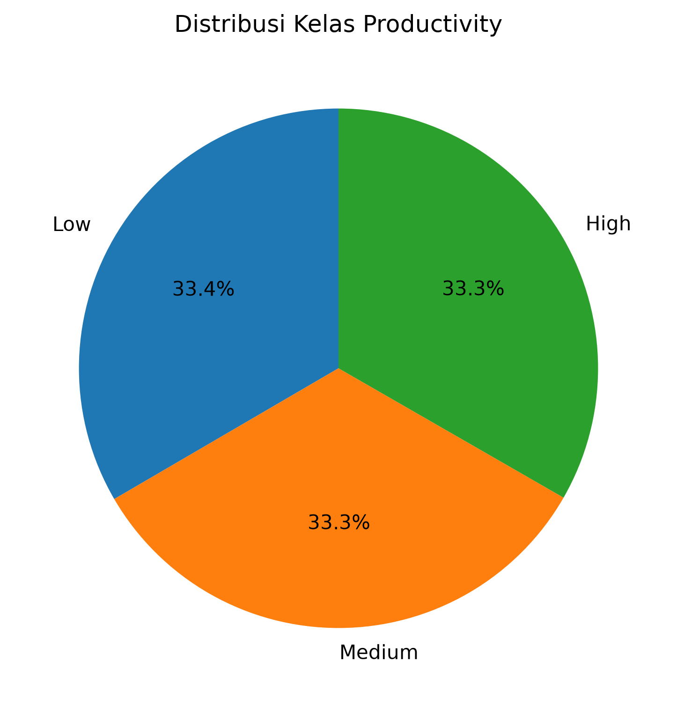

Berdasarkan Gambar 4.1 terlihat bahwa variabel **Productivity** terdiri atas tiga kelas, yaitu **Low**, **Medium**, dan **High**. Distribusi kelas yang relatif seimbang memberikan keuntungan dalam proses pelatihan model karena mampu mengurangi potensi bias terhadap salah satu kelas. Kondisi tersebut diharapkan dapat meningkatkan kemampuan model dalam mempelajari karakteristik masing-masing kelas sehingga menghasilkan performa klasifikasi yang lebih baik pada tahap evaluasi.

## 4.3 Exploratory Data Analysis (EDA)

Exploratory Data Analysis (EDA) merupakan tahapan yang bertujuan untuk memahami karakteristik data melalui berbagai teknik visualisasi dan analisis statistik sebelum dilakukan proses pembangunan model machine learning. Tahap ini berfungsi untuk mengidentifikasi pola data, mengetahui distribusi setiap atribut, mendeteksi adanya nilai ekstrem (_outlier_), melihat hubungan antar variabel, serta mengevaluasi keseimbangan kelas pada variabel target.

Melalui proses EDA, peneliti dapat memperoleh gambaran awal mengenai kondisi dataset sehingga proses _preprocessing_ dan pemilihan algoritma dapat dilakukan secara lebih tepat. Selain itu, hasil eksplorasi data juga menjadi dasar dalam menentukan perlakuan terhadap data, seperti proses _encoding_, standardisasi data numerik, maupun evaluasi terhadap kemungkinan terjadinya ketidakseimbangan kelas (_imbalanced class_).

Pada penelitian ini, proses Exploratory Data Analysis dilakukan menggunakan beberapa jenis visualisasi, yaitu histogram untuk melihat distribusi atribut numerik, pie chart untuk mengetahui distribusi kelas produktivitas, countplot untuk menganalisis distribusi atribut kategorikal, boxplot untuk mendeteksi _outlier_, heatmap untuk melihat korelasi antar fitur numerik, serta pairplot untuk mengamati hubungan antar atribut numerik berdasarkan kelas produktivitas.

Seluruh visualisasi dibuat menggunakan pustaka **Matplotlib** dan **Seaborn** pada bahasa pemrograman Python. Setiap hasil visualisasi akan dianalisis untuk memperoleh informasi yang dapat mendukung proses pembangunan model klasifikasi produktivitas petani.

### 4.3.1 Distribusi Data Numerik (Histogram)

Histogram digunakan untuk mengetahui distribusi setiap atribut numerik pada dataset. Melalui histogram dapat diketahui pola penyebaran data, tingkat variasi data, serta indikasi adanya nilai ekstrem (_outlier_) maupun distribusi yang tidak merata. Informasi ini sangat penting karena dapat memengaruhi proses pemodelan machine learning.

Pada penelitian ini, histogram dibuat untuk seluruh atribut numerik, yaitu **Age**, **Annual_Income_USD**, **Years_of_Experience**, **Fertilizer_Use_kg_per_acre**, **Pesticide_Use_liters_per_acre**, dan **Yield_per_Acre_kg** menggunakan pustaka **Seaborn** dan **Matplotlib**.

**Gambar 4.1 Histogram Distribusi Variabel Numerik**

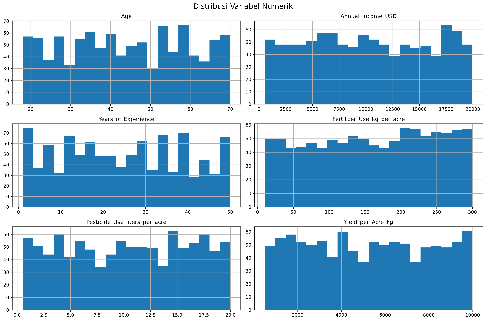

Berdasarkan Gambar 4.1, setiap atribut numerik memiliki pola distribusi yang relatif merata pada rentang nilainya masing-masing. Variabel **Age** menunjukkan bahwa usia petani tersebar pada rentang 18 hingga 70 tahun tanpa adanya dominasi yang sangat tinggi pada kelompok usia tertentu. Hal ini menunjukkan bahwa dataset mencakup petani dari berbagai kelompok usia.

Variabel **Annual_Income_USD** memperlihatkan distribusi pendapatan tahunan petani yang cukup luas, mulai dari sekitar 550 USD hingga hampir 20.000 USD. Sebaran ini menunjukkan adanya variasi kondisi ekonomi petani yang menjadi salah satu faktor penting dalam analisis produktivitas.

Variabel **Years_of_Experience** juga memiliki distribusi yang cukup merata pada rentang 1 hingga 50 tahun. Hal ini menunjukkan bahwa dataset mencakup petani dengan tingkat pengalaman yang beragam, mulai dari petani pemula hingga petani yang telah berpengalaman selama puluhan tahun.

Pada atribut **Fertilizer_Use_kg_per_acre** dan **Pesticide_Use_liters_per_acre**, distribusi data terlihat menyebar secara merata tanpa adanya penumpukan yang ekstrem pada nilai tertentu. Demikian pula pada atribut **Yield_per_Acre_kg**, distribusi hasil panen menunjukkan variasi yang cukup besar, yang mengindikasikan adanya perbedaan tingkat produktivitas antar petani.

Secara keseluruhan, histogram menunjukkan bahwa atribut numerik pada dataset memiliki penyebaran data yang cukup baik dan tidak memperlihatkan ketimpangan distribusi yang ekstrem. Kondisi ini mendukung proses pembangunan model klasifikasi karena model akan memperoleh variasi data yang memadai untuk mempelajari pola hubungan antar variabel.

### 4.3.2 Distribusi Variabel Target (Countplot Productivity)

Variabel target pada penelitian ini adalah **Productivity**, yang digunakan sebagai kelas dalam proses klasifikasi. Sebelum dilakukan pembangunan model machine learning, perlu diketahui terlebih dahulu distribusi jumlah data pada setiap kelas untuk memastikan apakah dataset memiliki distribusi yang seimbang (_balanced dataset_) atau tidak.

Visualisasi distribusi kelas dilakukan menggunakan **countplot** dari pustaka Seaborn. Grafik ini menunjukkan jumlah data pada setiap kategori produktivitas yang terdapat pada dataset.

**Gambar 4.2 Distribusi Variabel Target (Productivity)**

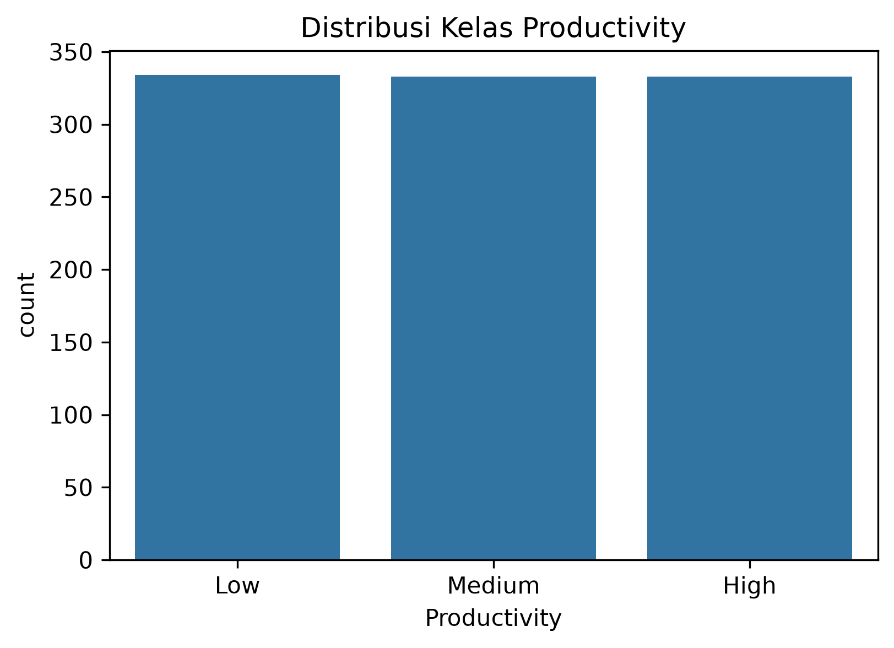

Berdasarkan Gambar 4.2, variabel **Productivity** terdiri atas tiga kategori, yaitu **Low**, **Medium**, dan **High**. Ketiga kategori tersebut memiliki jumlah data yang hampir sama, yaitu sekitar 333 hingga 334 data pada masing-masing kelas dari total 1.000 data.

Distribusi yang relatif seimbang menunjukkan bahwa dataset tidak mengalami permasalahan _class imbalance_. Kondisi ini memberikan keuntungan dalam proses pembangunan model klasifikasi karena setiap kelas memiliki jumlah data yang hampir sama sehingga model tidak akan cenderung mempelajari salah satu kelas saja.

Dataset yang seimbang juga memberikan hasil evaluasi yang lebih representatif. Nilai akurasi, precision, recall, maupun F1-score yang diperoleh dari model Decision Tree dan K-Nearest Neighbor (KNN) nantinya dapat menggambarkan performa model secara lebih objektif tanpa dipengaruhi oleh dominasi salah satu kelas.

Berdasarkan hasil visualisasi tersebut dapat disimpulkan bahwa variabel target telah memiliki distribusi yang baik sehingga tidak diperlukan teknik penyeimbangan data seperti **Random Oversampling**, **Random Undersampling**, maupun **SMOTE** sebelum proses pelatihan model dilakukan.

### 4.3.3 Distribusi Ukuran Lahan (Farm Size)

Ukuran lahan merupakan salah satu faktor yang berpotensi memengaruhi tingkat produktivitas hasil pertanian. Semakin luas lahan yang dimiliki petani, semakin besar pula potensi hasil panen yang dapat diperoleh. Oleh karena itu, dilakukan analisis terhadap distribusi ukuran lahan untuk mengetahui proporsi masing-masing kategori pada dataset.

Visualisasi distribusi ukuran lahan dilakukan menggunakan **countplot** sehingga jumlah data pada setiap kategori dapat diamati dengan lebih jelas.

**Gambar 4.3 Distribusi Ukuran Lahan (Farm Size)**

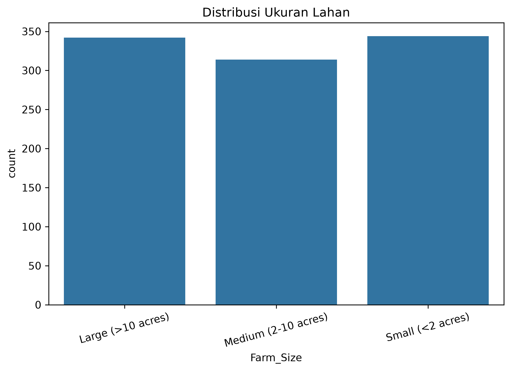

Berdasarkan Gambar 4.3, variabel **Farm_Size** terdiri atas tiga kategori, yaitu **Small (<2 acres)**, **Medium (2–10 acres)**, dan **Large (>10 acres)**. Ketiga kategori tersebut memiliki jumlah data yang relatif seimbang sehingga tidak terdapat dominasi salah satu kategori ukuran lahan dalam dataset.

Distribusi ukuran lahan yang seimbang menunjukkan bahwa dataset telah merepresentasikan berbagai skala kepemilikan lahan pertanian, mulai dari lahan kecil, sedang, hingga besar. Keberagaman tersebut memberikan informasi yang lebih lengkap kepada model machine learning dalam mempelajari hubungan antara ukuran lahan dengan tingkat produktivitas petani.

Selain itu, keseimbangan jumlah data pada setiap kategori dapat mengurangi potensi bias model terhadap salah satu kelompok ukuran lahan. Dengan demikian, model yang dibangun diharapkan mampu melakukan klasifikasi produktivitas secara lebih objektif pada berbagai kondisi kepemilikan lahan.

Hasil visualisasi menunjukkan bahwa variabel **Farm_Size** memiliki distribusi yang baik dan cukup representatif untuk digunakan sebagai salah satu fitur dalam proses klasifikasi produktivitas petani.

### 4.3.4 Distribusi Jenis Tanaman (Crop Type)

Jenis tanaman (_Crop Type_) merupakan salah satu atribut kategorikal yang berpotensi memengaruhi tingkat produktivitas pertanian. Setiap jenis tanaman memiliki karakteristik pertumbuhan, kebutuhan nutrisi, metode budidaya, serta potensi hasil panen yang berbeda. Oleh karena itu, dilakukan analisis terhadap distribusi jenis tanaman untuk mengetahui persebaran data pada setiap kategori yang terdapat dalam dataset.

Visualisasi distribusi jenis tanaman dilakukan menggunakan **countplot** dari pustaka Seaborn. Grafik ini digunakan untuk menampilkan jumlah data pada setiap kategori tanaman sehingga dapat diketahui apakah terdapat jenis tanaman yang mendominasi dataset.

**
**Gambar 4.4 Distribusi Jenis Tanaman (Crop Type)**

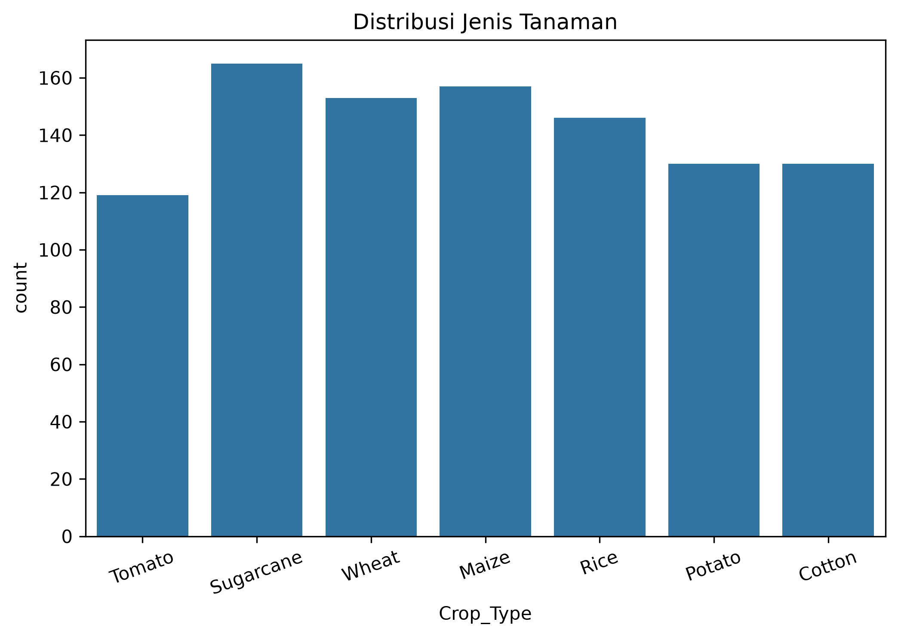

Berdasarkan Gambar 4.4, dataset terdiri atas beberapa jenis tanaman yang menjadi objek penelitian, yaitu **potato**, **Rice**, **Wheat**, **Maize**, **
cotton**, **Sugarcane**, dan **Tomato**. Masing-masing jenis tanaman memiliki jumlah data yang relatif seimbang sehingga tidak terdapat satu kategori yang mendominasi keseluruhan dataset.

Distribusi data yang seimbang pada setiap jenis tanaman memberikan keuntungan dalam proses pembangunan model klasifikasi. Model dapat mempelajari karakteristik masing-masing jenis tanaman secara lebih optimal tanpa dipengaruhi oleh dominasi jumlah data pada kategori tertentu. Dengan demikian, hasil klasifikasi produktivitas diharapkan mampu memberikan performa yang lebih baik pada berbagai jenis tanaman yang terdapat dalam dataset.

Selain itu, keberagaman jenis tanaman menunjukkan bahwa dataset telah merepresentasikan berbagai komoditas pertanian yang umum dibudidayakan. Variasi tersebut memungkinkan model machine learning untuk mengenali hubungan antara jenis tanaman dengan atribut lainnya, seperti ukuran lahan, penggunaan pupuk, penggunaan pestisida, pengalaman petani, serta hasil panen.

Berdasarkan hasil visualisasi dapat disimpulkan bahwa variabel **Crop_Type** memiliki distribusi data yang baik dan cukup representatif untuk digunakan sebagai salah satu fitur dalam proses klasifikasi produktivitas petani.

### 4.3.5 Analisis Outlier (Boxplot)

Setelah mengetahui distribusi data pada setiap variabel, tahapan berikutnya adalah mendeteksi keberadaan **outlier** atau nilai ekstrem pada atribut numerik. Outlier merupakan data yang memiliki nilai jauh berbeda dibandingkan sebagian besar data lainnya. Keberadaan outlier dapat memengaruhi proses pembelajaran model machine learning, terutama pada algoritma yang sensitif terhadap penyebaran data.

Pada penelitian ini, deteksi outlier dilakukan menggunakan **boxplot**. Visualisasi boxplot menampilkan nilai minimum, kuartil pertama (Q1), median, kuartil ketiga (Q3), serta nilai maksimum. Selain itu, titik-titik yang berada di luar batas whisker menunjukkan adanya data yang termasuk kategori outlier.

**Gambar 4.5 Deteksi Outlier pada Variabel Numerik**

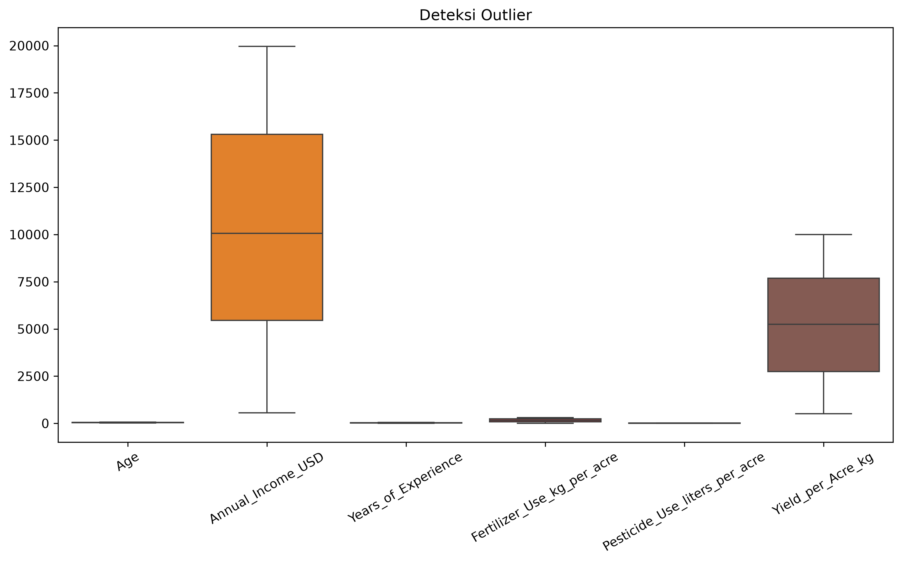

Berdasarkan Gambar 4.5, dapat diamati bahwa sebagian besar variabel numerik memiliki penyebaran data yang cukup baik. Meskipun terdapat beberapa titik yang berada di luar batas whisker, jumlahnya relatif sedikit sehingga tidak menunjukkan adanya penyimpangan data yang signifikan.

Keberadaan beberapa outlier merupakan kondisi yang umum dijumpai pada data pertanian. Perbedaan kondisi geografis, luas lahan, pengalaman petani, penggunaan pupuk, maupun hasil panen dapat menyebabkan munculnya nilai yang lebih tinggi atau lebih rendah dibandingkan data lainnya. Oleh karena itu, keberadaan outlier pada penelitian ini masih dianggap sebagai variasi alami dari data dan tidak secara langsung dihapus dari dataset.

Selain itu, algoritma yang digunakan dalam penelitian ini, yaitu **Decision Tree** dan **K-Nearest Neighbor (KNN)**, masih mampu menangani keberadaan sejumlah kecil outlier, terutama Decision Tree yang relatif tidak sensitif terhadap nilai ekstrem. Oleh karena itu, proses pembangunan model dilakukan menggunakan data asli tanpa menghapus data outlier.

Hasil analisis menunjukkan bahwa kualitas data masih berada pada kondisi yang baik dan layak digunakan pada proses klasifikasi produktivitas petani.

### 4.3.6 Analisis Korelasi Antar Variabel (Heatmap)

Selain mengetahui distribusi data, penting untuk menganalisis hubungan antar variabel numerik dalam dataset. Analisis korelasi bertujuan untuk mengetahui tingkat hubungan linear antara satu variabel dengan variabel lainnya. Informasi ini dapat digunakan untuk memahami karakteristik data serta mengetahui apakah terdapat variabel yang memiliki hubungan sangat kuat yang berpotensi menyebabkan redundansi informasi.

Pada penelitian ini, analisis korelasi dilakukan menggunakan **heatmap** berdasarkan nilai koefisien korelasi Pearson. Nilai koefisien korelasi berada pada rentang -1 hingga 1, di mana nilai yang mendekati 1 menunjukkan hubungan positif yang kuat, nilai mendekati -1 menunjukkan hubungan negatif yang kuat, sedangkan nilai yang mendekati 0 menunjukkan hubungan yang lemah atau tidak terdapat hubungan linear.

**Gambar 4.6 Heatmap Korelasi Antar Variabel Numerik**

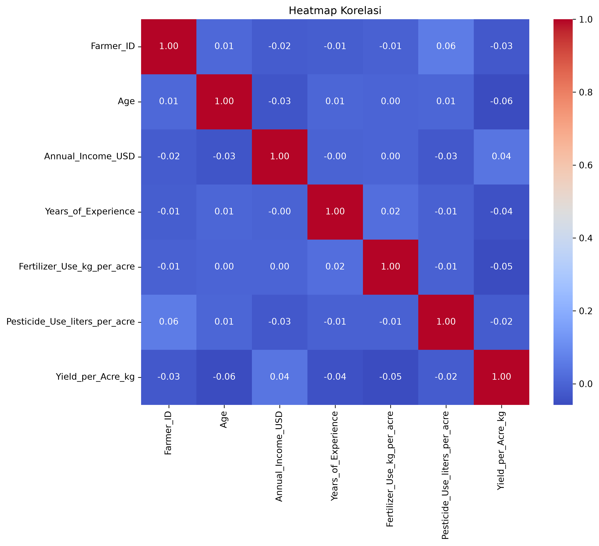

Berdasarkan Gambar 4.6, sebagian besar variabel numerik memiliki tingkat korelasi yang rendah hingga sedang. Hal tersebut menunjukkan bahwa setiap variabel memberikan informasi yang berbeda dan saling melengkapi dalam proses pembentukan model klasifikasi.

Variabel **Yield_per_Acre_kg** terlihat memiliki hubungan yang lebih tinggi terhadap beberapa variabel dibandingkan atribut numerik lainnya. Kondisi ini menunjukkan bahwa hasil panen per hektar merupakan salah satu indikator yang memiliki keterkaitan dengan karakteristik petani, seperti penggunaan pupuk, penggunaan pestisida, pengalaman bertani, maupun pendapatan tahunan.

Sementara itu, variabel seperti **Age**, **Annual_Income_USD**, **Years_of_Experience**, **Fertilizer_Use_kg_per_acre**, dan **Pesticide_Use_liters_per_acre** tidak menunjukkan korelasi yang sangat tinggi satu sama lain. Hal ini mengindikasikan bahwa tidak terjadi **multikolinearitas** yang signifikan pada dataset, sehingga seluruh variabel masih layak digunakan sebagai fitur pada proses klasifikasi.

Hasil analisis korelasi menunjukkan bahwa dataset memiliki karakteristik yang baik untuk proses pembangunan model machine learning. Tidak adanya hubungan yang terlalu kuat antar variabel numerik menunjukkan bahwa setiap fitur masih memberikan kontribusi informasi yang berbeda terhadap proses prediksi produktivitas petani.

### 4.3.7 Analisis Hubungan Antar Variabel (Pairplot)

Tahap akhir pada Exploratory Data Analysis (EDA) adalah menganalisis hubungan antar variabel numerik menggunakan **pairplot**. Visualisasi ini bertujuan untuk mengamati pola hubungan antar atribut numerik berdasarkan kelas produktivitas (_Productivity_). Selain itu, pairplot juga digunakan untuk melihat distribusi setiap variabel numerik pada diagonal grafik serta penyebaran data pada kombinasi dua variabel yang berbeda.

Pada penelitian ini, pairplot dibuat menggunakan pustaka **Seaborn** dengan variabel target **Productivity** sebagai pembeda warna (_hue_). Dengan demikian, pola penyebaran masing-masing kelas produktivitas dapat diamati secara visual.

**Gambar 4.7 Analisis Hubungan Antar Variabel Menggunakan Pairplot**

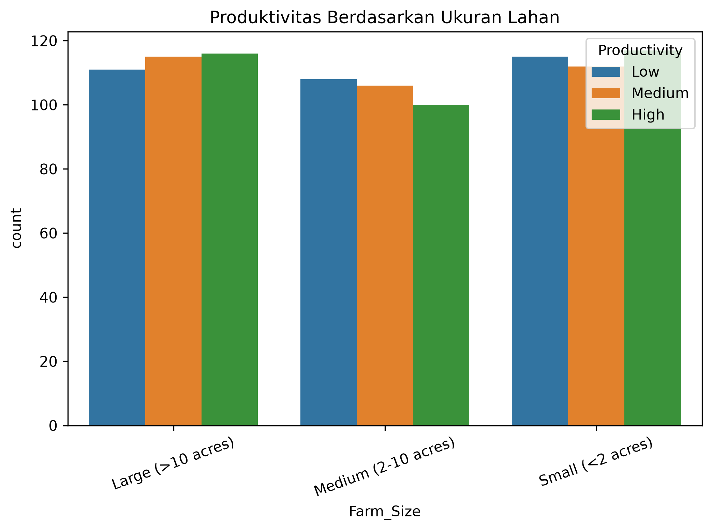

Berdasarkan Gambar 4.7, terlihat bahwa setiap pasangan variabel numerik memiliki pola penyebaran data yang cukup beragam. Distribusi pada diagonal pairplot menunjukkan bahwa masing-masing atribut numerik memiliki penyebaran yang relatif merata tanpa adanya dominasi pada rentang nilai tertentu.

Sementara itu, grafik sebar (_scatter plot_) pada setiap kombinasi variabel memperlihatkan bahwa kelas **Small**, **Medium**, dan **Large** saling beririsan (_overlap_). Hal tersebut menunjukkan bahwa pemisahan kelas produktivitas tidak dapat dilakukan hanya berdasarkan satu atau dua atribut saja, melainkan dipengaruhi oleh kombinasi beberapa fitur yang terdapat pada dataset.

Hasil pairplot juga menunjukkan bahwa tidak terdapat hubungan linear yang sangat kuat antar variabel numerik. Sebaran data terlihat cukup menyebar pada setiap kombinasi atribut sehingga mengindikasikan bahwa masing-masing variabel memberikan informasi yang berbeda dalam proses klasifikasi.

Berdasarkan hasil analisis tersebut dapat disimpulkan bahwa proses klasifikasi produktivitas petani memerlukan pemanfaatan seluruh atribut yang tersedia agar model machine learning mampu mempelajari pola hubungan antar variabel secara optimal. Oleh karena itu, seluruh fitur yang telah melalui proses _preprocessing_ digunakan pada tahap pembangunan model Decision Tree dan K-Nearest Neighbor (KNN).

## 4.4 Data Preparation

Data Preparation merupakan tahapan yang dilakukan untuk mempersiapkan data sebelum digunakan pada proses pembangunan model machine learning. Tahap ini bertujuan agar data memiliki format yang sesuai dengan kebutuhan algoritma klasifikasi serta mampu menghasilkan model dengan performa yang lebih baik.

Pada penelitian ini, proses Data Preparation meliputi pengubahan data kategorikal menjadi data numerik menggunakan **Label Encoding**, pemisahan atribut menjadi variabel independen (_feature_) dan variabel dependen (_target_), pembagian dataset menjadi data latih dan data uji menggunakan metode **train-test split**, serta standardisasi data numerik menggunakan **StandardScaler**.

Tahapan Data Preparation dilakukan setelah proses Exploratory Data Analysis (EDA) selesai sehingga karakteristik data telah dipahami terlebih dahulu sebelum dilakukan proses pembangunan model klasifikasi menggunakan algoritma Decision Tree dan K-Nearest Neighbor (KNN).

### 4.4.1 Label Encoding

Tahap pertama pada proses _Data Preparation_ adalah melakukan **Label Encoding** terhadap seluruh variabel yang bertipe kategorikal. Proses ini bertujuan untuk mengubah data berbentuk teks (_string_) menjadi data numerik sehingga dapat diproses oleh algoritma machine learning. Algoritma **Decision Tree** dan **K-Nearest Neighbor (KNN)** tidak dapat mengolah data kategorikal secara langsung, sehingga diperlukan proses transformasi ke dalam bentuk bilangan.

Pada penelitian ini, proses _Label Encoding_ dilakukan menggunakan kelas **LabelEncoder** dari pustaka **Scikit-learn**. Setiap kategori pada suatu atribut diberikan kode numerik yang unik tanpa mengubah jumlah data maupun informasi yang terkandung di dalamnya.

Variabel yang dilakukan proses _Label Encoding_ meliputi:

- Country
- Gender
- Farm_Size
- Crop_Type
- Irrigation_Method
- Education_Level
- Market_Access
- Productivity

Setelah proses encoding selesai, seluruh atribut kategorikal telah berhasil dikonversi menjadi data numerik sehingga dapat digunakan pada proses pembangunan model machine learning.

**Tabel 4.8 Hasil Label Encoding (5 Data Pertama)**

| Farmer_ID | Country | Age | Gender | Farm_Size | Crop_Type | Annual_Income_USD | Irrigation_Method | Education_Level | Years_of_Experience | Market_Access | Fertilizer_Use_kg_per_acre | Pesticide_Use_liters_per_acre | Yield_per_Acre_kg | Productivity |
| --------: | ------: | --: | -----: | --------: | --------: | ----------------: | ----------------: | --------------: | ------------------: | ------------: | -------------------------: | ----------------------------: | ----------------: | :----------- |
|         1 |       3 |  48 |      1 |         0 |         5 |             15365 |                 0 |               3 |                  18 |             1 |                     105.44 |                         12.86 |              2194 | Low          |
|         2 |       3 |  46 |      1 |         1 |         4 |              6624 |                 4 |               3 |                  44 |             1 |                     160.63 |                          3.26 |              9669 | High         |
|         3 |       4 |  22 |      0 |         2 |         6 |             15358 |                 0 |               0 |                   2 |             0 |                     133.59 |                         14.61 |              1092 | Low          |
|         4 |       2 |  42 |      0 |         1 |         5 |             18008 |                 2 |               2 |                  49 |             1 |                     240.62 |                         14.19 |              1470 | Low          |
|         5 |       4 |  33 |      0 |         2 |         1 |              9860 |                 1 |               4 |                  11 |             0 |                     133.03 |                          4.32 |              9576 | High         |

Berdasarkan Tabel 4.8, seluruh atribut kategorikal telah berhasil dikonversi menjadi nilai numerik. Sebagai contoh, atribut **Country**, **Gender**, **Farm_Size**, **Crop_Type**, **Irrigation_Method**, **Education_Level**, dan **Market_Access** telah berubah dari bentuk teks menjadi bilangan bulat. Proses ini memungkinkan algoritma machine learning untuk membaca serta memproses data secara optimal.

Perlu diperhatikan bahwa nilai numerik hasil _Label Encoding_ tidak menunjukkan urutan maupun tingkatan tertentu, melainkan hanya berfungsi sebagai identitas dari setiap kategori. Misalnya, nilai **Gender = 1** tidak berarti lebih tinggi dibandingkan **Gender = 0**, tetapi hanya merupakan hasil pengkodean otomatis oleh **LabelEncoder**.

Dengan selesainya proses _Label Encoding_, seluruh atribut pada dataset telah memiliki format numerik yang sesuai untuk digunakan pada tahapan selanjutnya, yaitu pemisahan **feature** dan **target**, pembagian data latih dan data uji, serta proses standardisasi data.

### 4.4.2 Pemisahan Feature dan Target

Setelah seluruh data berada dalam format yang sesuai, tahapan berikutnya adalah melakukan pemisahan antara variabel **feature (X)** dan variabel **target (y)**. Tujuan dari proses ini adalah agar algoritma machine learning dapat mempelajari hubungan antara variabel independen dengan variabel yang akan diprediksi.

Pada penelitian ini, variabel **Productivity** digunakan sebagai variabel target karena merupakan kelas yang akan diprediksi oleh model. Sementara itu, seluruh atribut selain **Productivity** digunakan sebagai variabel feature yang berfungsi sebagai masukan (_input_) bagi model klasifikasi.

Variabel feature terdiri atas:

- Farmer_ID
- Country
- Age
- Gender
- Farm_Size
- Crop_Type
- Annual_Income_USD
- Irrigation_Method
- Education_Level
- Years_of_Experience
- Market_Access
- Fertilizer_Use_kg_per_acre
- Pesticide_Use_liters_per_acre
- Yield_per_Acre_kg

Sedangkan variabel target adalah:

- Productivity

Proses pemisahan dilakukan menggunakan fungsi **drop()** dari pustaka Pandas untuk mengambil seluruh atribut selain variabel target sebagai feature, sedangkan kolom **Productivity** disimpan sebagai variabel target.

**Tabel 4.9 Pembagian Feature dan Target**

| Variabel    | Keterangan                                                                                                                                                                                                                     |
| ----------- | ------------------------------------------------------------------------------------------------------------------------------------------------------------------------------------------------------------------------------ |
| Feature (X) | Farmer_ID, Country, Age, Gender, Farm_Size, Crop_Type, Annual_Income_USD, Irrigation_Method, Education_Level, Years_of_Experience, Market_Access, Fertilizer_Use_kg_per_acre, Pesticide_Use_liters_per_acre, Yield_per_Acre_kg |
| Target (y)  | Productivity                                                                                                                                                                                                                   |

Berdasarkan proses tersebut diperoleh dua buah variabel utama yang akan digunakan pada tahap berikutnya. Variabel **X** berisi seluruh atribut yang digunakan sebagai masukan model, sedangkan variabel **y** berisi kelas produktivitas yang menjadi tujuan prediksi.

Pemisahan feature dan target merupakan tahapan yang sangat penting dalam proses machine learning karena memastikan bahwa model hanya mempelajari hubungan antara atribut masukan dengan variabel target tanpa terjadi kebocoran data (_data leakage_). Dengan demikian, model yang dihasilkan dapat melakukan proses prediksi secara objektif terhadap data baru.

### 4.4.3 Pembagian Data Latih dan Data Uji (Train-Test Split)

Setelah data dipisahkan menjadi variabel **feature (X)** dan **target (y)**, tahapan berikutnya adalah melakukan pembagian dataset menjadi **data latih (training data)** dan **data uji (testing data)**. Pembagian ini bertujuan agar model dapat dilatih menggunakan sebagian data, kemudian dievaluasi menggunakan data yang belum pernah dilihat sebelumnya.

Pada penelitian ini, proses pembagian data dilakukan menggunakan fungsi **train_test_split()** dari pustaka **Scikit-learn**. Dataset dibagi dengan perbandingan **80% data latih** dan **20% data uji**. Selain itu, parameter **random_state = 42** digunakan agar proses pembagian data bersifat tetap (_reproducible_), sehingga hasil penelitian dapat diperoleh secara konsisten apabila kode dijalankan kembali.

Hasil pembagian dataset ditunjukkan pada Tabel 4.10.

**Tabel 4.10 Pembagian Data Latih dan Data Uji**

| Jenis Data                 | Jumlah Data | Persentase |
| -------------------------- | ----------: | ---------: |
| Data Latih (Training Data) |         800 |        80% |
| Data Uji (Testing Data)    |         200 |        20% |
| **Total Dataset**          |    **1000** |   **100%** |

Berdasarkan Tabel 4.10, sebanyak **800 data** digunakan sebagai data latih untuk membangun model klasifikasi, sedangkan **200 data** digunakan sebagai data uji untuk mengevaluasi performa model. Dengan pembagian tersebut, model memperoleh data yang cukup untuk mempelajari pola hubungan antar variabel sekaligus menyediakan data yang independen untuk mengukur kemampuan prediksi model.

Penggunaan metode **train-test split** merupakan salah satu teknik yang umum digunakan dalam pengembangan model machine learning. Teknik ini membantu mengurangi risiko **overfitting**, yaitu kondisi ketika model hanya mampu mengenali data pelatihan tetapi memiliki performa yang rendah saat dihadapkan pada data baru.

Melalui pembagian data ini, proses evaluasi terhadap algoritma **Decision Tree** dan **K-Nearest Neighbor (KNN)** dapat dilakukan secara objektif karena kedua model diuji menggunakan data yang tidak digunakan selama proses pelatihan.

### 4.4.4 Standardisasi Data (StandardScaler)

Tahap terakhir pada proses _Data Preparation_ adalah melakukan **standardisasi data** menggunakan metode **StandardScaler** dari pustaka **Scikit-learn**. Standardisasi bertujuan untuk menyamakan skala seluruh variabel numerik sehingga setiap atribut memiliki kontribusi yang seimbang selama proses pembelajaran model.

Pada dataset penelitian ini, beberapa atribut memiliki rentang nilai yang cukup berbeda. Sebagai contoh, variabel **Annual_Income_USD** memiliki nilai hingga puluhan ribu, sedangkan **Pesticide_Use_liters_per_acre** hanya berada pada rentang puluhan. Perbedaan skala tersebut dapat memengaruhi performa algoritma yang menggunakan perhitungan jarak, seperti **K-Nearest Neighbor (KNN)**.

Proses standardisasi dilakukan setelah dataset dibagi menjadi data latih dan data uji. Hal ini bertujuan untuk mencegah terjadinya **data leakage**, yaitu kondisi ketika informasi dari data uji ikut memengaruhi proses pelatihan model.

Pada penelitian ini, objek **StandardScaler** terlebih dahulu dilatih (_fit_) menggunakan data latih, kemudian digunakan untuk mentransformasikan data latih dan data uji menggunakan metode **transform()**. Dengan cara tersebut, parameter rata-rata (_mean_) dan simpangan baku (_standard deviation_) hanya dihitung berdasarkan data latih sehingga proses evaluasi model menjadi lebih objektif.

Setelah dilakukan standardisasi, setiap variabel numerik memiliki nilai rata-rata (_mean_) yang mendekati **0** dan simpangan baku (_standard deviation_) yang mendekati **1**. Kondisi ini membuat setiap fitur memiliki skala yang seragam sehingga algoritma K-Nearest Neighbor dapat menghitung jarak antar data dengan lebih akurat.

Proses standardisasi memberikan pengaruh yang signifikan terhadap algoritma **K-Nearest Neighbor (KNN)** karena algoritma tersebut menentukan kelas berdasarkan kedekatan jarak antar data. Sebaliknya, algoritma **Decision Tree** tidak bergantung pada perhitungan jarak sehingga pengaruh standardisasi terhadap performanya relatif kecil. Meskipun demikian, pada penelitian ini standardisasi tetap dilakukan sebagai bagian dari proses _preprocessing_ agar seluruh data memiliki format yang seragam sebelum digunakan pada tahap pembangunan model.

Dengan selesainya proses standardisasi, dataset telah siap digunakan pada tahap berikutnya, yaitu pembangunan model klasifikasi menggunakan algoritma **Decision Tree** dan **K-Nearest Neighbor (KNN)**.

## 4.5 Pembangunan Model (Modeling)

Tahap pembangunan model (_Modeling_) merupakan proses utama dalam penelitian machine learning. Pada tahap ini dilakukan pelatihan model menggunakan data latih (_training data_) yang telah melalui proses _Data Preparation_. Tujuan dari tahap ini adalah menghasilkan model yang mampu mengenali pola hubungan antara variabel-variabel input dengan kelas produktivitas petani sehingga dapat digunakan untuk melakukan prediksi pada data baru.

Penelitian ini menggunakan dua algoritma klasifikasi, yaitu **Decision Tree** dan **K-Nearest Neighbor (KNN)**. Kedua algoritma dipilih karena memiliki karakteristik yang berbeda sehingga dapat dibandingkan performanya dalam melakukan klasifikasi produktivitas petani.

Setelah model berhasil dibangun, dilakukan proses **Hyperparameter Tuning** menggunakan **GridSearchCV** untuk memperoleh kombinasi parameter terbaik. Selanjutnya, model terbaik dipilih berdasarkan hasil evaluasi menggunakan beberapa metrik performa, yaitu **Accuracy**, **Precision**, **Recall**, dan **F1-Score**.

### 4.5.1 Pembangunan Model Decision Tree

Model pertama yang dibangun pada penelitian ini adalah **Decision Tree Classifier**. Decision Tree merupakan algoritma klasifikasi yang bekerja dengan membentuk struktur pohon keputusan (_decision tree_), di mana setiap simpul (_node_) merepresentasikan proses pengambilan keputusan berdasarkan nilai suatu atribut.

Pada penelitian ini, model Decision Tree dibangun menggunakan pustaka **Scikit-learn** dengan memanfaatkan data latih yang telah dipersiapkan pada tahap sebelumnya. Selama proses pelatihan, algoritma secara otomatis memilih atribut yang memiliki kemampuan terbaik dalam memisahkan kelas produktivitas berdasarkan nilai impurity yang dihitung pada setiap node.

Setelah proses pelatihan selesai, model menghasilkan struktur pohon keputusan yang digunakan untuk mengklasifikasikan data ke dalam tiga kelas produktivitas, yaitu **Low**, **Medium**, dan **High**.

**Gambar 4.8 Struktur Model Decision Tree**

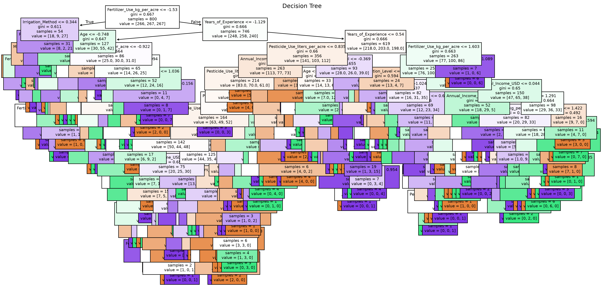

Berdasarkan Gambar 4.8, terlihat bahwa model Decision Tree membentuk serangkaian aturan keputusan berdasarkan atribut-atribut yang terdapat pada dataset. Setiap percabangan menunjukkan proses pemilihan atribut yang dianggap paling mampu membedakan kelas produktivitas petani.

Keunggulan Decision Tree adalah kemampuannya menghasilkan model yang mudah dipahami karena proses klasifikasi dapat dijelaskan dalam bentuk aturan (_if-then rule_). Selain itu, algoritma ini tidak terlalu sensitif terhadap perbedaan skala data sehingga tetap mampu bekerja dengan baik meskipun atribut memiliki rentang nilai yang berbeda.

Model Decision Tree yang telah dibangun selanjutnya digunakan untuk melakukan prediksi terhadap data uji. Hasil prediksi tersebut kemudian dievaluasi menggunakan confusion matrix serta berbagai metrik evaluasi untuk mengetahui tingkat akurasi model dalam melakukan klasifikasi produktivitas petani.

### 4.5.2 Pembangunan Model K-Nearest Neighbor (KNN)

Model kedua yang digunakan pada penelitian ini adalah **K-Nearest Neighbor (KNN)**. Algoritma KNN merupakan salah satu metode klasifikasi berbasis _instance-based learning_ yang bekerja dengan menentukan kelas suatu data berdasarkan kedekatan jaraknya terhadap sejumlah data tetangga terdekat (_nearest neighbors_).

Berbeda dengan Decision Tree yang membangun struktur pohon keputusan selama proses pelatihan, algoritma KNN tidak membentuk model secara eksplisit. Seluruh data latih disimpan sebagai referensi, kemudian proses klasifikasi dilakukan ketika terdapat data baru yang akan diprediksi. Data tersebut dibandingkan dengan seluruh data latih menggunakan perhitungan jarak, kemudian kelas ditentukan berdasarkan mayoritas dari sejumlah tetangga terdekat sesuai dengan nilai parameter **K**.

Karena algoritma KNN menggunakan perhitungan jarak antar data, maka pada penelitian ini dilakukan proses **standardisasi data** menggunakan **StandardScaler** sebelum model dibangun. Standardisasi bertujuan untuk menyamakan skala seluruh atribut sehingga tidak terdapat variabel yang memiliki pengaruh lebih besar hanya karena memiliki rentang nilai yang lebih tinggi.

Proses pembangunan model dilakukan menggunakan kelas **KNeighborsClassifier** dari pustaka **Scikit-learn**. Model dilatih menggunakan data latih (_training data_) yang telah melalui tahap preprocessing, kemudian digunakan untuk melakukan prediksi terhadap data uji (_testing data_).

Algoritma KNN mengklasifikasikan suatu data berdasarkan kedekatan jaraknya terhadap sejumlah tetangga terdekat. Oleh karena itu, pemilihan nilai parameter **K** menjadi salah satu faktor yang sangat memengaruhi performa model. Nilai K yang terlalu kecil dapat menyebabkan model menjadi sensitif terhadap _noise_, sedangkan nilai K yang terlalu besar dapat mengurangi kemampuan model dalam membedakan karakteristik setiap kelas.

Keunggulan algoritma KNN terletak pada proses implementasinya yang sederhana dan kemampuannya dalam melakukan klasifikasi tanpa membangun model yang kompleks. Namun demikian, waktu komputasi KNN cenderung lebih besar dibandingkan Decision Tree karena proses perhitungan jarak dilakukan setiap kali model melakukan prediksi.

Model K-Nearest Neighbor yang telah dibangun selanjutnya digunakan untuk melakukan prediksi terhadap data uji. Hasil prediksi kemudian dievaluasi menggunakan **Confusion Matrix**, **Accuracy**, **Precision**, **Recall**, dan **F1-Score**. Seluruh hasil evaluasi tersebut akan dibahas pada subbab evaluasi model untuk membandingkan performa algoritma KNN dengan Decision Tree.

### 4.5.3 Hyperparameter Tuning

Setelah model Decision Tree dan K-Nearest Neighbor (KNN) berhasil dibangun, tahap berikutnya adalah melakukan **Hyperparameter Tuning**. Tujuan dari proses ini adalah memperoleh kombinasi parameter terbaik sehingga model dapat memberikan performa klasifikasi yang lebih optimal dibandingkan menggunakan parameter bawaan (_default_).

Pada penelitian ini, proses tuning dilakukan menggunakan metode **GridSearchCV** dari pustaka **Scikit-learn**. Metode ini bekerja dengan menguji berbagai kombinasi parameter yang telah ditentukan, kemudian mengevaluasi setiap kombinasi menggunakan teknik **Cross Validation**. Kombinasi parameter yang menghasilkan nilai evaluasi terbaik akan dipilih sebagai parameter akhir dalam pembangunan model.

Hyperparameter tuning dilakukan pada kedua algoritma yang digunakan dalam penelitian, yaitu **Decision Tree** dan **K-Nearest Neighbor (KNN)**.

**Tabel 4.11 Parameter yang Diuji**

| Algoritma          | Parameter yang Diuji |
| ------------------ | -------------------- |
| Decision Tree      | criterion, max_depth |
| K-Nearest Neighbor | n_neighbors, weights |

Melalui proses GridSearchCV, setiap kombinasi parameter dibandingkan berdasarkan nilai akurasi hasil validasi silang (_cross validation_). Parameter yang menghasilkan nilai akurasi tertinggi kemudian digunakan sebagai parameter terbaik untuk membangun model akhir yang akan dievaluasi pada tahap berikutnya.

### 4.5.4 Model Terbaik

Berdasarkan hasil proses **Hyperparameter Tuning** menggunakan **GridSearchCV**, diperoleh kombinasi parameter terbaik untuk masing-masing algoritma. Parameter tersebut kemudian digunakan sebagai konfigurasi akhir dalam proses pelatihan model sebelum dilakukan evaluasi menggunakan data uji.

Hasil parameter terbaik yang diperoleh ditunjukkan pada Tabel 4.12.

**Tabel 4.12 Hasil Hyperparameter Tuning**

| Algoritma          | Parameter Terbaik                  | Best Accuracy |
| ------------------ | ---------------------------------- | ------------: |
| Decision Tree      | criterion = gini, max_depth = 3    |        0.3450 |
| K-Nearest Neighbor | n_neighbors = 7, weights = uniform |        0.3275 |

Berdasarkan Tabel 4.12, algoritma **Decision Tree** memperoleh parameter terbaik menggunakan **criterion = gini** dan **max_depth = 3**, dengan nilai akurasi validasi sebesar **0,3450**. Sementara itu, algoritma **K-Nearest Neighbor (KNN)** memperoleh parameter terbaik menggunakan **n_neighbors = 7** dan **weights = uniform**, dengan nilai akurasi validasi sebesar **0,3275**.

Hasil tersebut menunjukkan bahwa model Decision Tree memiliki nilai akurasi validasi yang sedikit lebih tinggi dibandingkan model KNN pada tahap Hyperparameter Tuning. Oleh karena itu, kedua model selanjutnya digunakan untuk melakukan prediksi terhadap data uji dan dievaluasi menggunakan Confusion Matrix, Accuracy, Precision, Recall, dan F1-Score untuk mengetahui performa klasifikasi secara keseluruhan.

## 4.6 Evaluasi Model

Tahap evaluasi model dilakukan untuk mengetahui kemampuan masing-masing algoritma dalam mengklasifikasikan tingkat produktivitas petani. Pada penelitian ini, evaluasi dilakukan menggunakan empat metrik utama, yaitu **Accuracy**, **Precision**, **Recall**, dan **F1-Score**. Selain itu, hasil prediksi juga divisualisasikan menggunakan **Confusion Matrix** untuk melihat distribusi prediksi yang benar maupun salah pada setiap kelas produktivitas.

Evaluasi dilakukan terhadap dua algoritma klasifikasi yang telah dibangun sebelumnya, yaitu **Decision Tree** dan **K-Nearest Neighbor (KNN)**. Selanjutnya dilakukan perbandingan performa kedua model untuk menentukan algoritma yang memberikan hasil terbaik pada dataset penelitian.

### 4.6.1 Evaluasi Model Decision Tree

Setelah proses pelatihan selesai, model Decision Tree digunakan untuk melakukan prediksi terhadap data uji. Hasil prediksi kemudian dievaluasi menggunakan Confusion Matrix dan beberapa metrik evaluasi.

**Gambar 4.10 Confusion Matrix Decision Tree**

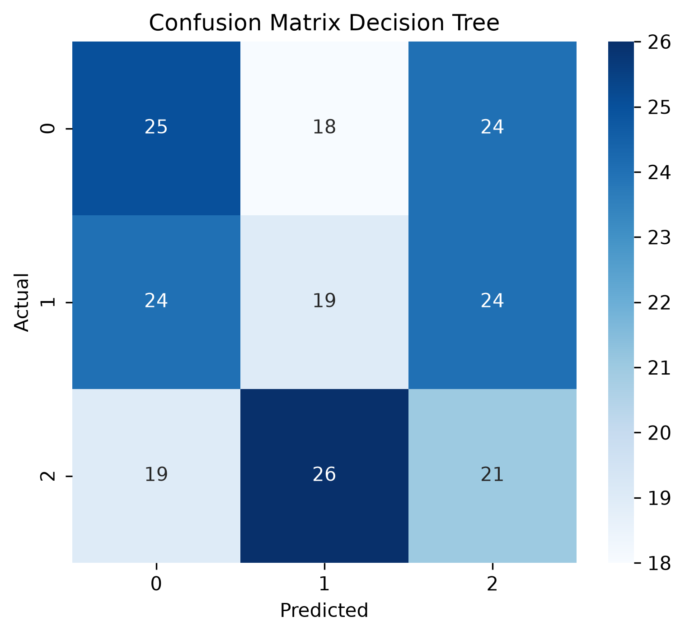

Berdasarkan hasil evaluasi, model Decision Tree memperoleh nilai performa sebagai berikut.

**Tabel 4.13 Hasil Evaluasi Model Decision Tree**

| Metrik | Nilai |
|---------|------:|
| Accuracy | 0.325 |
| Precision | 0.3246 |
| Recall | 0.3250 |
| F1-Score | 0.3247 |

Berdasarkan Tabel 4.13, model Decision Tree memperoleh nilai **Accuracy sebesar 32,5%**. Nilai Precision sebesar **32,46%**, Recall sebesar **32,50%**, dan F1-Score sebesar **32,47%** menunjukkan bahwa kemampuan model dalam mengklasifikasikan produktivitas petani masih tergolong rendah.

Hasil tersebut menunjukkan bahwa model Decision Tree belum mampu mempelajari pola data secara optimal. Hal ini dapat disebabkan oleh karakteristik dataset yang cukup kompleks sehingga pemisahan kelas menggunakan struktur pohon keputusan belum memberikan hasil klasifikasi yang maksimal.

### 4.6.2 Evaluasi Model K-Nearest Neighbor (KNN)

Model K-Nearest Neighbor (KNN) juga dievaluasi menggunakan data uji yang sama sehingga hasilnya dapat dibandingkan secara objektif dengan model Decision Tree.

**Gambar 4.11 Confusion Matrix K-Nearest Neighbor**

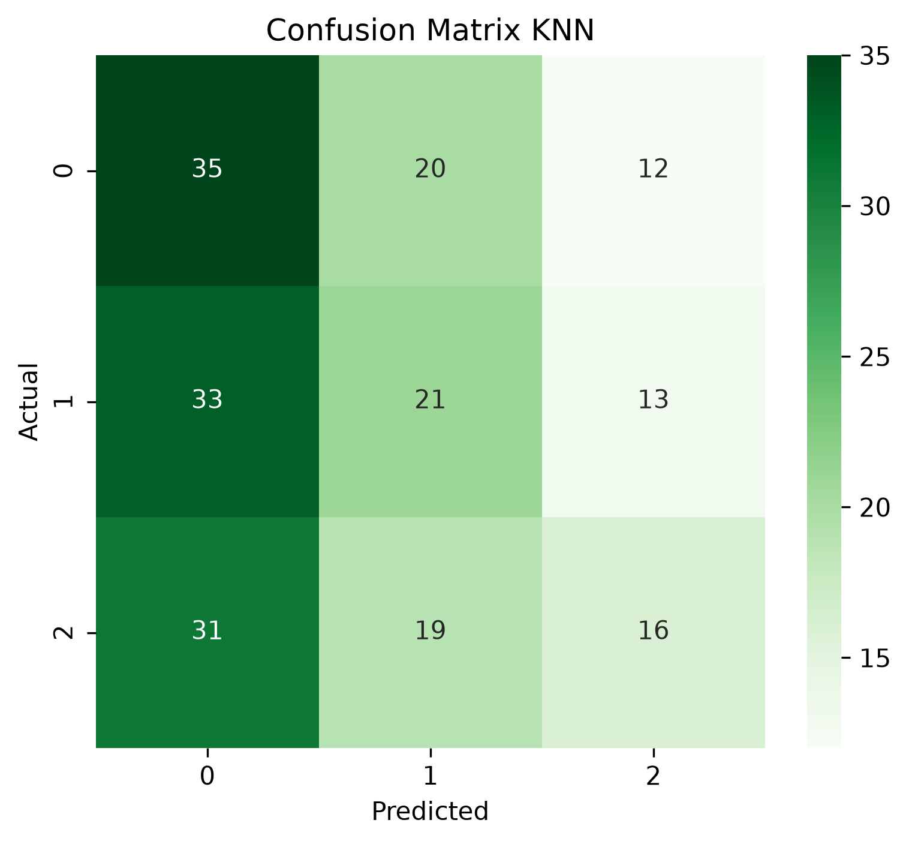

Hasil evaluasi model KNN ditunjukkan pada Tabel 4.14.

**Tabel 4.14 Hasil Evaluasi Model KNN**

| Metrik | Nilai |
|---------|------:|
| Accuracy | 0.3600 |
| Precision | 0.3645 |
| Recall | 0.3600 |
| F1-Score | 0.3507 |

Berdasarkan hasil evaluasi, algoritma KNN memperoleh nilai **Accuracy sebesar 36,0%**. Nilai Precision mencapai **36,45%**, Recall sebesar **36,00%**, sedangkan F1-Score sebesar **35,07%**.

Hasil tersebut menunjukkan bahwa model KNN memiliki kemampuan klasifikasi yang lebih baik dibandingkan Decision Tree pada seluruh metrik evaluasi yang digunakan. Peningkatan performa ini menunjukkan bahwa pendekatan berbasis jarak pada algoritma KNN lebih mampu mengenali pola yang terdapat pada dataset produktivitas petani dibandingkan algoritma Decision Tree.

### 4.6.3 Perbandingan Performa Kedua Model

Setelah kedua model dievaluasi, dilakukan perbandingan performa untuk mengetahui algoritma yang memberikan hasil terbaik dalam mengklasifikasikan produktivitas petani.

**Tabel 4.15 Perbandingan Performa Model**

| Model | Accuracy | Precision | Recall | F1-Score |
|--------|---------:|----------:|-------:|---------:|
| Decision Tree | 0.3250 | 0.3246 | 0.3250 | 0.3247 |
| K-Nearest Neighbor | 0.3600 | 0.3645 | 0.3600 | 0.3507 |

**Gambar 4.12 Perbandingan Performa Model**

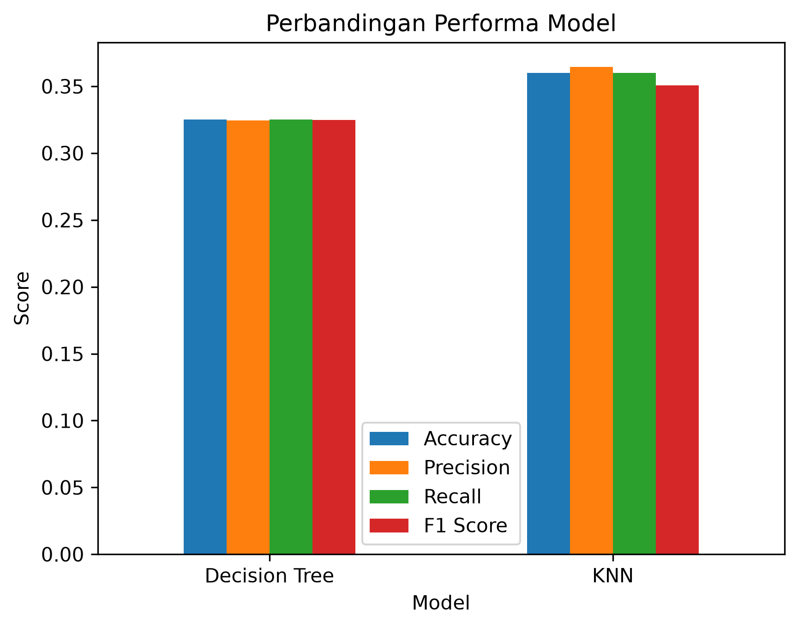

Berdasarkan Tabel 4.15 dan Gambar 4.12, terlihat bahwa algoritma **K-Nearest Neighbor (KNN)** memberikan performa yang lebih baik dibandingkan Decision Tree pada seluruh metrik evaluasi.

Model KNN memperoleh nilai Accuracy sebesar **36,0%**, sedangkan Decision Tree memperoleh **32,5%**. Hal yang sama juga terlihat pada nilai Precision, Recall, dan F1-Score, di mana seluruh nilai KNN lebih tinggi dibandingkan Decision Tree.

Walaupun perbedaan performa kedua model tidak terlalu besar, hasil penelitian menunjukkan bahwa algoritma KNN lebih sesuai digunakan pada dataset produktivitas petani dibandingkan algoritma Decision Tree. Oleh karena itu, model KNN dipilih sebagai model terbaik dalam penelitian ini.

## 4.7 Kesimpulan BAB IV

Berdasarkan seluruh tahapan yang telah dilakukan, mulai dari Data Understanding, Exploratory Data Analysis (EDA), Data Preparation, pembangunan model, Hyperparameter Tuning, hingga evaluasi model, dapat disimpulkan bahwa proses pengolahan data berhasil dilaksanakan dengan baik.

Dua algoritma klasifikasi yang digunakan dalam penelitian ini adalah **Decision Tree** dan **K-Nearest Neighbor (KNN)**. Setelah dilakukan Hyperparameter Tuning menggunakan GridSearchCV, kedua model dievaluasi menggunakan metrik Accuracy, Precision, Recall, dan F1-Score.

Hasil evaluasi menunjukkan bahwa algoritma **K-Nearest Neighbor (KNN)** memberikan performa terbaik dengan Accuracy sebesar **36,0%**, Precision sebesar **36,45%**, Recall sebesar **36,0%**, dan F1-Score sebesar **35,07%**. Sementara itu, Decision Tree memperoleh Accuracy sebesar **32,5%** dengan nilai Precision, Recall, dan F1-Score yang sedikit lebih rendah.

Berdasarkan hasil tersebut, algoritma **K-Nearest Neighbor (KNN)** dipilih sebagai model terbaik untuk melakukan klasifikasi tingkat produktivitas petani pada dataset yang digunakan dalam penelitian ini.